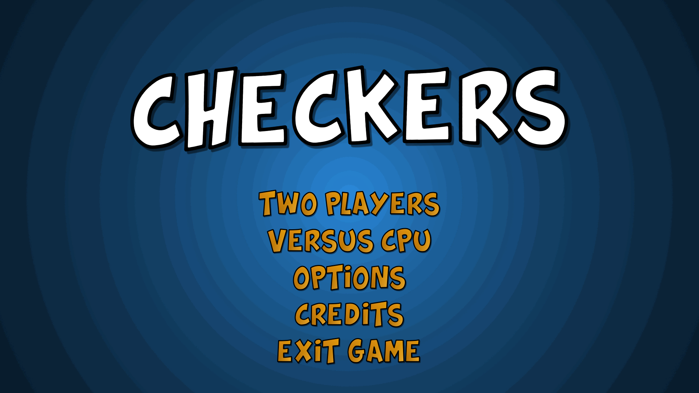
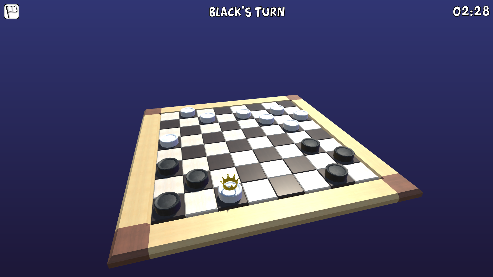
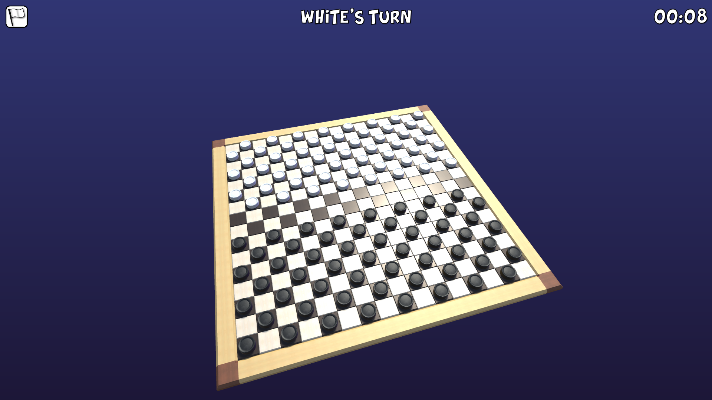
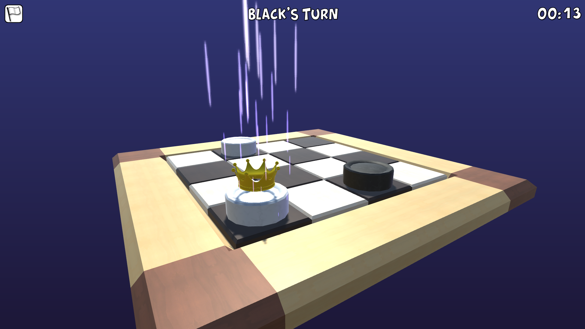

# Checkers
Simple Checkers game in Unity.

## Authors

* **Pawel Cembaluk** - everything except 3D models
* **Szymon Józwicki** - 3D models

## Built with

* [Microsoft Visual Studio 2017](https://visualstudio.microsoft.com/pl/downloads/) - IDE
* [Sourcetree](https://www.sourcetreeapp.com/) - version control
* [Unity3D](https://unity3d.com/) - game engine

## Screenshots
|  |  |
|:-------------------------:|:-------------------------:|
|  |  |